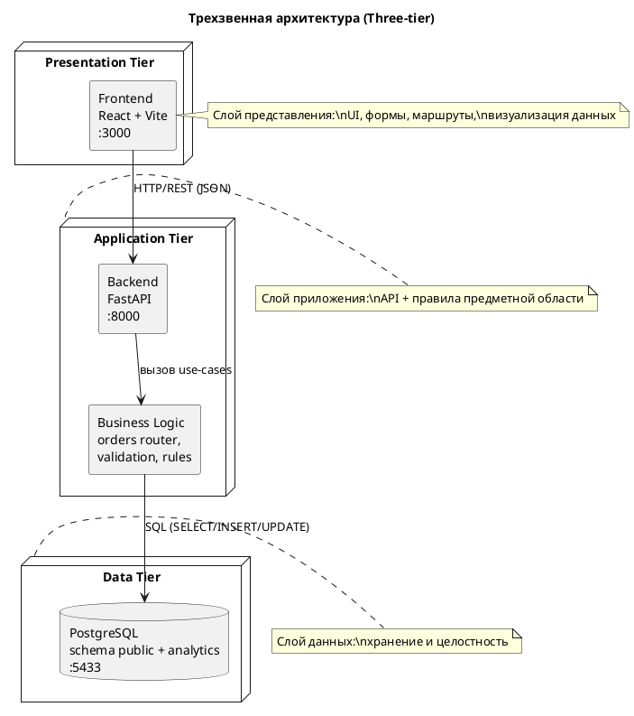

# Three-Tier Architecture Diagram

Документация по трехзвенной архитектуре сервиса.

## Назначение

Диаграмма разделяет систему на три слоя:
- Presentation Tier (Frontend);
- Application Tier (Backend + бизнес-логика);
- Data Tier (PostgreSQL).

## PlantUML

