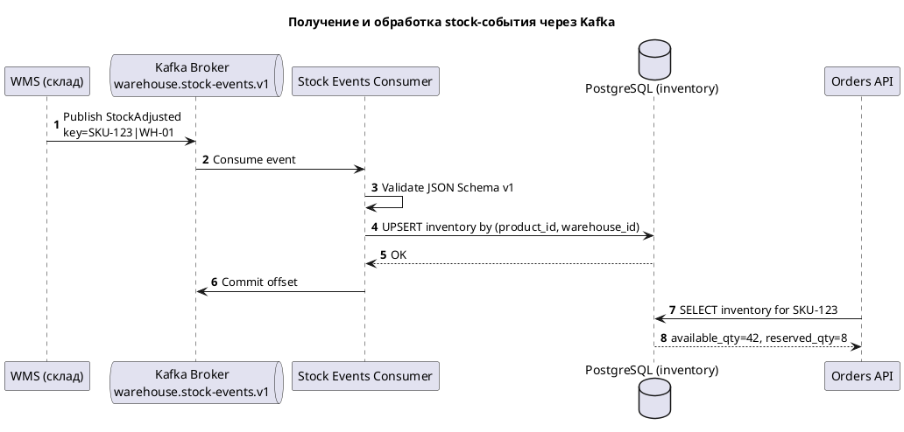

# Kafka Stock Events: Message Contract

Подробная спецификация сообщения для топика `warehouse.stock-events.v1`.

## 1) Пример сообщения

**Topic:** `warehouse.stock-events.v1`  
**Key:** `SKU-123|WH-01`

```json
{
  "event_id": "evt-9f3b2b89-5b2f-4d4f-9c77-1b6f0b7eab11",
  "event_type": "StockAdjusted",
  "event_version": 1,
  "occurred_at": "2026-04-22T14:25:31Z",
  "source": "wms",
  "trace_id": "trc-7d4f2a1c90b3",
  "data": {
    "warehouse_id": "WH-01",
    "product_id": "SKU-123",
    "available_qty": 42,
    "reserved_qty": 8,
    "reason": "inventory_count_correction",
    "changed_by": "cycle-count-job"
  }
}
```

## 2) JSON Schema (v1)

```json
{
  "$schema": "https://json-schema.org/draft/2020-12/schema",
  "$id": "https://example.com/schemas/warehouse.stock-events.v1.schema.json",
  "title": "WarehouseStockEventV1",
  "type": "object",
  "additionalProperties": false,
  "required": [
    "event_id",
    "event_type",
    "event_version",
    "occurred_at",
    "source",
    "trace_id",
    "data"
  ],
  "properties": {
    "event_id": {
      "type": "string",
      "pattern": "^evt-[a-zA-Z0-9-]{8,}$",
      "description": "Уникальный идентификатор события для дедупликации"
    },
    "event_type": {
      "type": "string",
      "enum": ["StockReserved", "StockReleased", "StockAdjusted"],
      "description": "Тип доменного события по стоку"
    },
    "event_version": {
      "type": "integer",
      "const": 1,
      "description": "Версия контракта события"
    },
    "occurred_at": {
      "type": "string",
      "format": "date-time",
      "description": "Время возникновения события в UTC"
    },
    "source": {
      "type": "string",
      "const": "wms",
      "description": "Система-источник"
    },
    "trace_id": {
      "type": "string",
      "minLength": 8,
      "maxLength": 128,
      "description": "Трассировочный ID для корреляции логов"
    },
    "data": {
      "type": "object",
      "additionalProperties": false,
      "required": [
        "warehouse_id",
        "product_id",
        "available_qty",
        "reserved_qty",
        "reason",
        "changed_by"
      ],
      "properties": {
        "warehouse_id": {
          "type": "string",
          "minLength": 2,
          "maxLength": 32
        },
        "product_id": {
          "type": "string",
          "minLength": 2,
          "maxLength": 64
        },
        "available_qty": {
          "type": "integer",
          "minimum": 0
        },
        "reserved_qty": {
          "type": "integer",
          "minimum": 0
        },
        "reason": {
          "type": "string",
          "minLength": 2,
          "maxLength": 100
        },
        "changed_by": {
          "type": "string",
          "minLength": 2,
          "maxLength": 100
        }
      }
    }
  }
}
```

## 3) Пояснение JSON Schema

| Ключ схемы | Что означает | Почему важно |
|---|---|---|
| `$schema` | Версия стандарта JSON Schema (draft 2020-12) | Единое поведение валидаторов |
| `required` | Список обязательных полей | Не допускает неполные события |
| `additionalProperties: false` | Запрещает лишние поля | Защищает от незаметного дрейфа контракта |
| `enum` / `const` | Ограничивает допустимые значения | Стабильная обработка в consumer |
| `format: date-time` | Формат времени | Корректный аудит и упорядочивание |
| `minimum` / `minLength` / `maxLength` | Границы значений | Защита от невалидных данных |

## 4) Таблица полей сообщения

| Поле | Тип | Обяз. | Описание | Пример |
|---|---|---|---|---|
| `event_id` | string | Да | Уникальный ID события для дедупликации | `evt-9f3b2b89-...` |
| `event_type` | string | Да | Тип события по стоку | `StockAdjusted` |
| `event_version` | integer | Да | Версия контракта события | `1` |
| `occurred_at` | string(date-time) | Да | Время возникновения в WMS (UTC) | `2026-04-22T14:25:31Z` |
| `source` | string | Да | Система-источник | `wms` |
| `trace_id` | string | Да | ID для трассировки | `trc-7d4f2a1c90b3` |
| `data.warehouse_id` | string | Да | Идентификатор склада | `WH-01` |
| `data.product_id` | string | Да | Идентификатор SKU | `SKU-123` |
| `data.available_qty` | integer | Да | Доступный остаток | `42` |
| `data.reserved_qty` | integer | Да | Зарезервированный остаток | `8` |
| `data.reason` | string | Да | Причина изменения | `inventory_count_correction` |
| `data.changed_by` | string | Да | Кто/что изменило остатки | `cycle-count-job` |

## 5) Диаграмма последовательности (PlantUML)



## 6) Операционные правила

- Использовать ключ Kafka: `product_id|warehouse_id`
- Делать consumer идемпотентным по `event_id`
- При невалидном payload отправлять событие в DLQ после ограниченных ретраев
