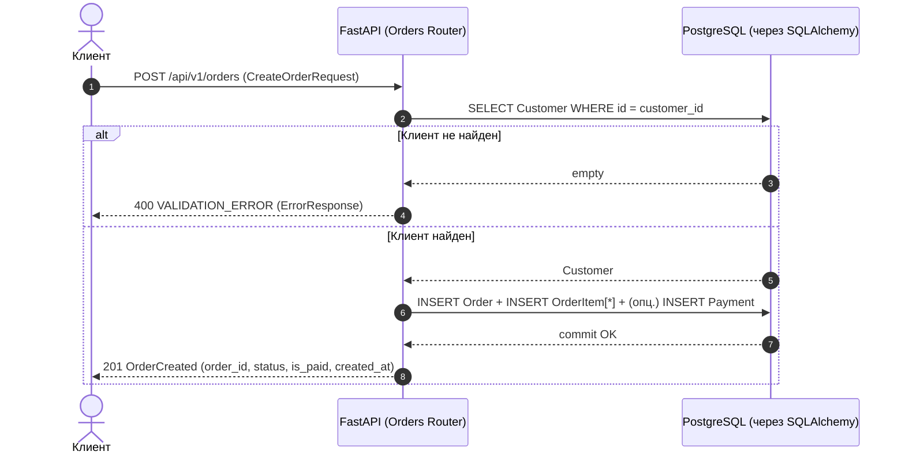
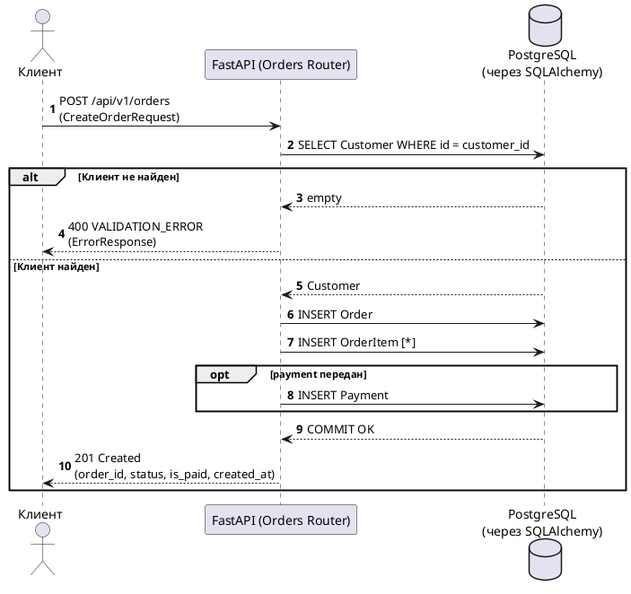

# Создание заказа (`POST /api/v1/orders`)

## Куда отправлять запрос

- **Method**: `POST`
- **URL**: `http://localhost:8000/api/v1/orders`
- **Content-Type**: `application/json`

## Назначение

Эндпоинт создаёт новый заказ для существующего клиента, сохраняет позиции заказа и (опционально) данные об оплате.
В ответ возвращается короткая “квитанция” о создании: `order_id`, текущий `status`, флаг `is_paid`, `created_at`.

---

## Входные параметры (JSON body)

### Объект `CreateOrderRequest`

| Поле | Тип | Обязательное | Ограничения | Описание |
|---|---|---:|---|---|
| `customer_id` | integer | да | \(>= 1\) | ID клиента, для которого создаётся заказ |
| `comment` | string \| null | нет |  | Комментарий к заказу |
| `source` | string \| null | нет |  | Источник заказа (например, `web`, `mobile`) |
| `tags` | string[] \| null | нет |  | Произвольные теги |
| `items` | OrderItem[] | да | minItems: 1 | Позиции заказа |
| `payment` | Payment \| null | нет |  | Информация об оплате (если передана — сохраняется) |

### Объект `OrderItem` (позиция заказа)

| Поле | Тип | Обязательное | Ограничения | Описание |
|---|---|---:|---|---|
| `product_id` | string | да |  | Идентификатор товара (SKU/код) |
| `name` | string | да |  | Наименование |
| `quantity` | integer | да | \(> 0\) | Количество |
| `price` | number | да | \(>= 0\) | Цена за единицу |
| `in_stock` | boolean | нет* | default: `true` | Признак “в наличии” (в текущей реализации можно передать явно) |

\* В Pydantic-модели `in_stock` имеет default, поэтому поле **не обязано** присутствовать в запросе.

### Объект `Payment` (оплата)

| Поле | Тип | Обязательное | Ограничения | Описание |
|---|---|---:|---|---|
| `method` | string | да |  | Способ оплаты (например, `card`, `cash`) |
| `total` | number | да | \(> 0\) | Итоговая сумма |
| `currency` | string | нет* | default: `RUB` | Валюта |
| `paid_at` | string(date-time) \| null | нет |  | В `POST /orders` не используется и не ожидается (в доменной сущности может появиться позже) |

\* В Pydantic-модели валюта имеет default, поэтому поле **не обязано** присутствовать в запросе.

---

## Пример запроса

```http
POST /api/v1/orders HTTP/1.1
Host: localhost:8000
Content-Type: application/json

{
  "customer_id": 11,
  "comment": "Доставить после 18:00",
  "source": "web",
  "tags": ["gift", "priority"],
  "items": [
    {
      "product_id": "SKU-2",
      "name": "Кроссовки",
      "quantity": 1,
      "price": 2590.5,
      "in_stock": true
    }
  ],
  "payment": {
    "method": "card",
    "total": 2590.5,
    "currency": "RUB"
  }
}
```

## Пример успешного ответа (201)

```json
{
  "order_id": "ORD-2026-1A2B",
  "status": "created",
  "is_paid": false,
  "created_at": "2026-04-16T10:00:00Z"
}
```

---

## Диаграмма последовательности (Sequence Diagram)



### PlantUML версия диаграммы



### Пояснение шагов диаграммы

1. **Клиент отправляет запрос** на создание заказа в формате JSON.
2. **API проверяет существование клиента** по `customer_id`.
3. **Альтернативный сценарий: клиент не найден**.
   - API возвращает `400` с `ErrorResponse` и кодом `VALIDATION_ERROR`.
4. **Основной сценарий: клиент найден**.
   - API создаёт запись `orders`, добавляет позиции `order_items`, и при наличии `payment` — создаёт запись `payments`.
   - После `commit` формируется короткий ответ о создании.

---

## Проверки, валидация и альтернативные сценарии

### 1) Валидация формата/типов (FastAPI/Pydantic) → `422`

Если тело запроса не соответствует схеме (нет обязательных полей, неверный тип, `items` пустой, `quantity <= 0`, `total <= 0` и т.д.), FastAPI вернёт:
- **HTTP 422** (пример структуры см. `ValidationError` в `openapi.yaml`)

Типичные причины:
- `items` отсутствует или пустой массив
- `quantity` \(\le 0\)
- `price` \(< 0\)
- `payment.total` \(\le 0\)

### 2) Клиент не найден → `400`

Если `customer_id` не существует в базе:
- **HTTP 400**
- `ErrorResponse`:

```json
{
  "error": "VALIDATION_ERROR",
  "message": "Клиент 999 не найден"
}
```

### 3) Оплата отсутствует (нормальный сценарий) → `201`

Поле `payment` можно не передавать или передать `null`.
Тогда заказ создаётся без записи об оплате, а в ответе `is_paid` останется `false`.

---

## Что является DTO в этом эндпоинте

Для `POST /api/v1/orders` используются DTO (Data Transfer Object) — формы обмена данными, удобные именно для этой операции:

- **DTO запроса**: `CreateOrderRequest` — содержит только то, что клиент должен прислать для создания заказа.
- **DTO ответа**: `OrderCreatedResponse` — короткий ответ, чтобы клиент сразу получил `order_id` и базовый статус, не запрашивая полный `Order`.

В `openapi.yaml` эти DTO оформлены так:
- `components/requestBodies/CreateOrderRequest`
- `components/responses/OrderCreatedResponse`
